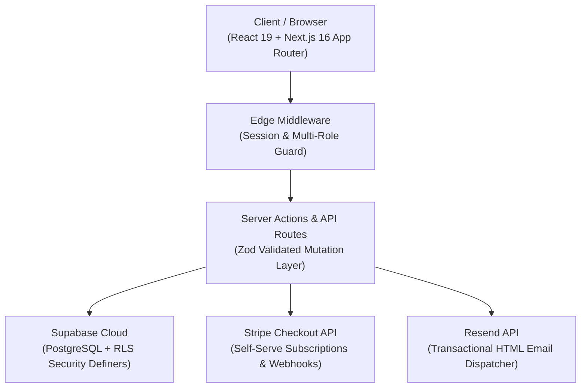
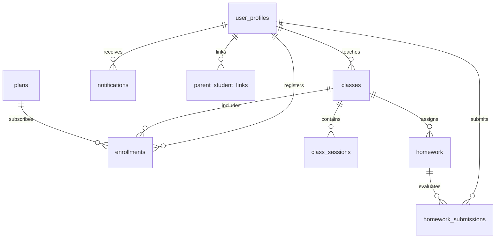

# ClassLoop 🚀 — Edtech Class Management Platform

> **ClassLoop** is an edtech platform built for **Ottodot** to power gamified science and math classrooms for learners aged 8–15. Built with multi-role isolation (Student, Teacher, Parent, Admin), Supabase, Row-Level Security, Stripe checkout, and Resend transactional notifications.

---

## 🌟 1-Click Demo Accounts

For reviewers and interviewers, quick-fill demo buttons are built directly into the [`/login`](http://localhost:3000/login) page:

| Role | Demo Email | Password | Primary Experience |
| :--- | :--- | :--- | :--- |
| 🎓 **Student** | `student@demo.com` | `DemoPassword123!` | Homework submission, instant rubric feedback, class schedule |
| 👨‍🏫 **Teacher** | `teacher@demo.com` | `DemoPassword123!` | Class rosters, homework assignment creator, split-view grading modal |
| 👨‍👩‍👧 **Parent** | `parent@demo.com` | `DemoPassword123!` | Child completion rate %, grade history, teacher evaluation notes |
| 🛡️ **Admin** | `admin@demo.com` | `DemoPassword123!` | User directory, parent-student linking, enrollment control, analytics |

---

## 🏗️ Architecture & Tech Stack



- **Frontend Framework:** Next.js 16.3.5 (App Router with Turbopack), React 19.2.8
- **Styling & UI:** Tailwind CSS v4, Shadcn/ui (`@base-ui/react`), Lucide React icons
- **Database & Auth:** Supabase Cloud (PostgreSQL 14.5 with Security Definer RLS policies & triggers)
- **Payment Infrastructure:** Stripe Checkout Session API & Webhook handler
- **Email & Notifications:** In-App Notification Center with real-time polling + Resend HTML email engine
- **Type Safety:** TypeScript (strict mode) with Supabase Database Type generation & Zod schemas
- **Process Methodology:** Document-as-Code (DAC) tracking with isolated task lifecycles

---

## 🚀 Key Modules & Capabilities

### 1. 🎓 Student Module (`/student/`)
- **Dashboard:** At-a-glance academic stats (Enrolled Classes, Graded Tasks, Average Score %, Upcoming Sessions).
- **Homework Portal (`/student/homework`):** Filter assignments by status (*All*, *To Do*, *Under Review*, *Graded*).
- **Submission Workspace (`/student/homework/[id]`):** Rich task prompt, text/attachment submission form, instant evaluation badge, and instructor feedback quote.
- **Class Schedule (`/student/schedule`):** Live calendar of upcoming interactive STEM sessions.

### 2. 👨‍🏫 Teacher Module (`/teacher/`)
- **Class Management (`/teacher/classes`):** Create live classes, monitor class capacity, view student roster and assignments.
- **Homework Creator (`/teacher/homework`):** Publish rich homework assignments with due dates and custom score baselines.
- **Grading Suite (`/teacher/homework/[id]/submissions`):** Split-view grading interface for evaluating student responses, assigning points, and delivering personalized feedback.

### 3. 👨‍👩‍👧 Parent Visibility Module (`/parent/`)
- **Family Dashboard (`/parent/dashboard`):** Real-time aggregate statistics for all linked children (Completion Rate %, Average Score, Recent Teacher Notes).
- **Children Grade Reports (`/parent/children`):** Comprehensive breakdown per child showing course enrollment, assignment score history, and teacher feedback.
- **Family Schedule (`/parent/schedule`):** Consolidated timeline of all upcoming class sessions across children.

### 4. 🛡️ Admin Operations Module (`/admin/`)
- **User Directory (`/admin/users`):** Complete user directory with role badges and instant role switching.
- **Parent-Student Linking (`/admin/users`):** Interactive modal to establish parental oversight links.
- **Enrollment Control (`/admin/enrollments`):** Direct class enrollment dialog and inline status changer (*Active*, *Completed*, *Cancelled*).
- **Platform Reports (`/admin/reports`):** Platform-wide academic KPIs, course-by-course completion rates, and turnaround analytics.

### 5. 💳 Self-Serve Enrollment & Payments
- **Marketing Landing Page (`/`):** High-converting STEM course showcase (Roblox Physics, Quantum Kids, Python Game Creators).
- **Pricing Tiers (`/#pricing`):** Transparent monthly subscriptions (*Starter Explorer $49*, *Pro Innovator $89*, *Master Scholar $149*).
- **Stripe Checkout API (`/api/checkout`):** Automated session creation with metadata injection.
- **Stripe Webhook (`/api/webhooks/stripe`):** Automatic enrollment fulfillment and welcome notification dispatch.

### 6. 🔔 Real-Time Notification Center
- **In-App Bell Dropdown:** Header notification bell with unread count badge, relative timestamps, and one-click mark as read.
- **Automated Lifecycle Triggers:** Automatically notifies students on new assignments, teachers on submissions, and parents on grade releases.
- **Transactional Email:** Responsive branded HTML templates delivered via Resend.

---

## 📊 Database Schema & Entity Relationships



---

## 🛠️ Local Setup & Reproduction Guide

### Prerequisites
- Node.js 20+ (LTS recommended)
- Supabase Cloud account (or local Supabase CLI)

### 1. Clone & Install Dependencies
```bash
git clone <repository_url>
cd ottodot
npm install
```

### 2. Environment Configuration
Create a `.env.local` file in the root directory:
```env
NEXT_PUBLIC_SUPABASE_URL=https://your-project.supabase.co
NEXT_PUBLIC_SUPABASE_ANON_KEY=your-supabase-anon-key
SUPABASE_SERVICE_ROLE_KEY=your-supabase-service-role-key

# Optional (for live email & stripe payments)
RESEND_API_KEY=re_your_resend_api_key
STRIPE_SECRET_KEY=sk_test_your_stripe_secret_key
STRIPE_WEBHOOK_SECRET=whsec_your_stripe_webhook_secret
```

### 3. Database Migrations & Seed
Apply database schema and populate with realistic demo accounts:
```bash
# Push migrations to Supabase
npx supabase db push

# Seed realistic English edtech data
npm run db:seed
```

### 4. Run Integration QA Verification
```bash
npx tsx scripts/verify-e2e.ts
```

### 5. Start Development Server
```bash
npm run dev
```
Open [http://localhost:3000](http://localhost:3000) to view the application.

---

## 🚀 Production Deployment (Vercel)

1. Push your code to GitHub.
2. Import the repository in [Vercel](https://vercel.com).
3. Configure the environment variables (`NEXT_PUBLIC_SUPABASE_URL`, `NEXT_PUBLIC_SUPABASE_ANON_KEY`, `SUPABASE_SERVICE_ROLE_KEY`, `RESEND_API_KEY`, `STRIPE_SECRET_KEY`).
4. Set the build command to `npm run build` and output directory to `.next`.
5. Deploy and verify live multi-role routing!

---

## 📜 Document-as-Code (DAC) Summary

This project strictly adheres to the Document-as-Code methodology. All active task records and design decisions are versioned in `document-as-code/Tasks/Archive/`:

- `task-001.md`: Project Setup & Tailwind v4
- `task-002.md`: Database Schema & PostgreSQL Migrations
- `task-003.md`: RLS Security Definers & TypeScript Types
- `task-004.md`: Multi-Role Auth System & Protected Middleware
- `task-005.md`: Responsive Sidebar, Header, and Dashboard Skeletons
- `task-006.md`: Teacher Classroom & Rubric Grading Module
- `task-007.md`: Student Homework & Live Schedule Module
- `task-008.md`: Parent Progress Visibility & Grade Reports
- `task-009.md`: Admin Operations & Academic Analytics
- `task-010.md`: In-App Notification Center & Resend Email Engine
- `task-011.md`: Public Landing Page, Pricing & Stripe Checkout
- `task-012.md`: Realistic English Seed Data & Demo Accounts
- `task-013.md`: Integration QA & End-to-End Test Suite
- `task-014.md`: Production Deployment Readiness & Portfolio README

---

*Built with ❤️ for Ottodot Edtech.*
