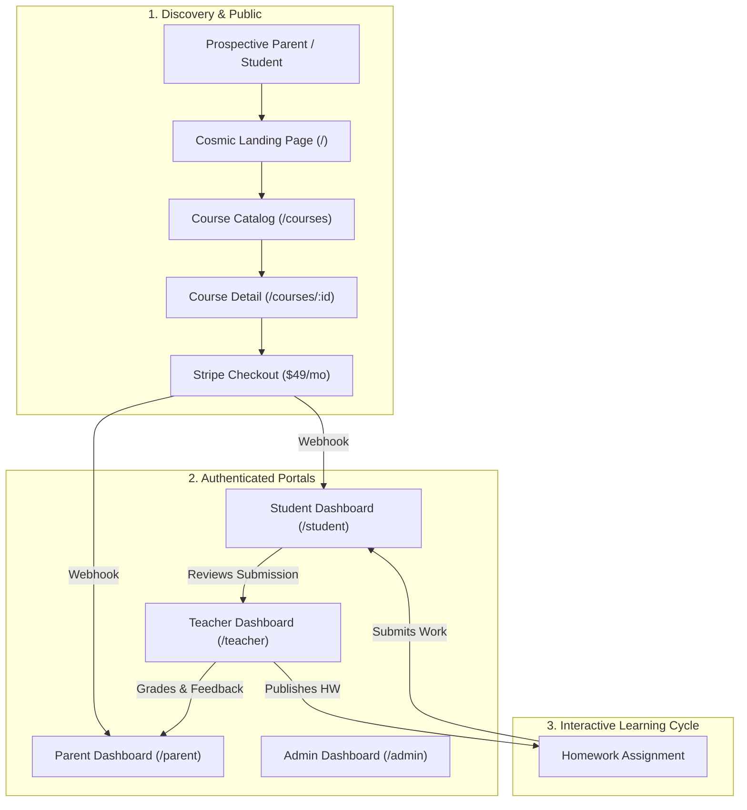
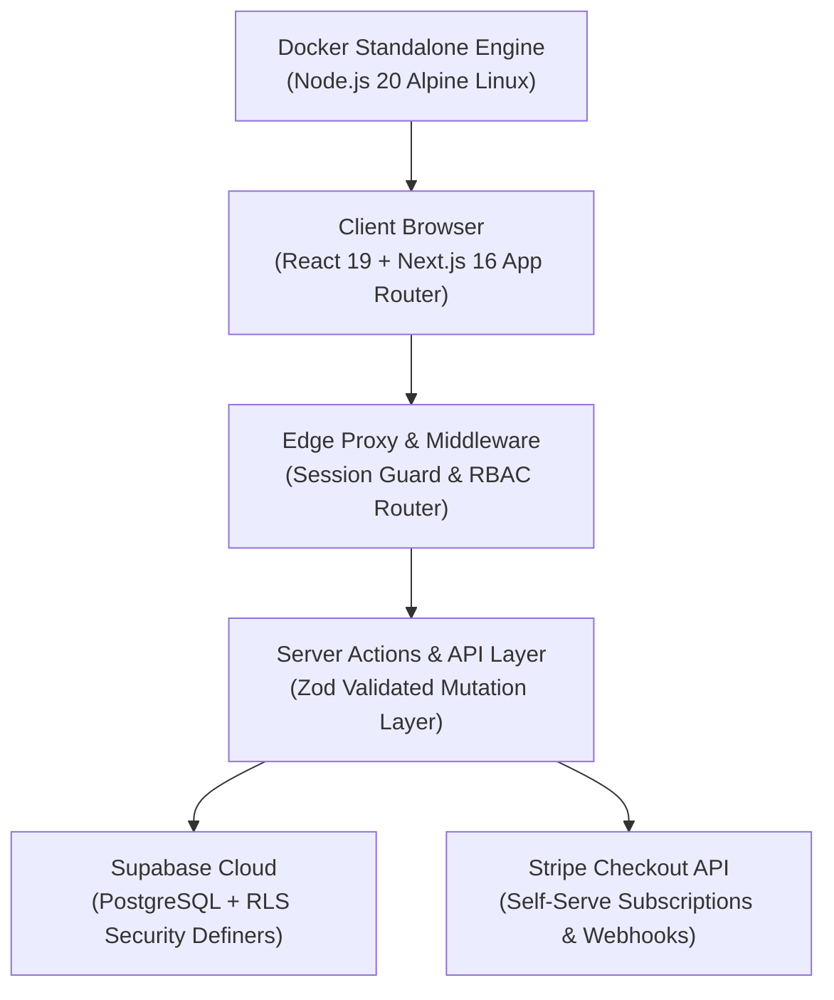
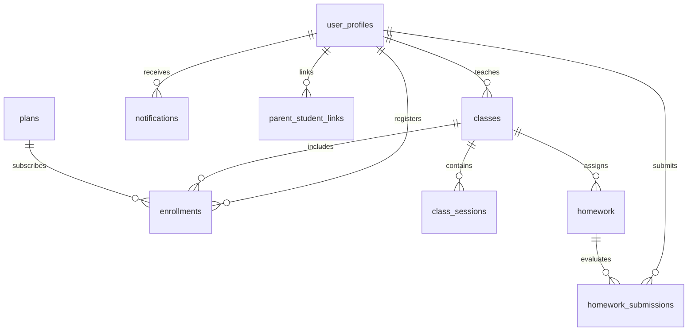

# ClassLoop 🚀 — Next-Gen Gamified STEM & EdTech Platform
**Built for Ottodot • Empowering Kids Through Playful Science & Math**

[-black?style=flat-square&logo=next.js)](https://nextjs.org/)
[](https://react.dev/)
[](https://www.typescriptlang.org/)
[](https://tailwindcss.com/)
[](https://supabase.com/)
[-2496ED?style=flat-square&logo=docker)](https://www.docker.com/)
[](https://stripe.com/)

> **ClassLoop** is an enterprise-grade, gamified STEM & EdTech learning platform developed for **Ottodot** to power interactive science, physics, and coding classrooms for kids aged **6–15**. Built with multi-role isolation (**Student, Teacher, Parent, Admin**), Supabase Row-Level Security, Stripe checkout, interactive course discovery catalog, and Docker standalone containerization.

---

## 🌟 1-Click Instant Demo Sandbox (Zero-Password)

Try any role directly from the **[Homepage](http://localhost:3000)** or **[`/login`](http://localhost:3000/login)** page with 1-click automatic authentication:

| Role | Demo Account Email | Password | Primary Experience & Use Case |
| :--- | :--- | :--- | :--- |
| 🎓 **Student** | `student@demo.com` | `DemoPassword123!` | Homework submission, live session countdown, interactive syllabus, gamified rewards |
| 👨‍🏫 **Teacher** | `teacher@demo.com` | `DemoPassword123!` | Class rosters, homework assignment creator, split-view rubric grading modal |
| 👨‍👩‍👧 **Parent** | `parent@demo.com` | `DemoPassword123!` | Child completion rate %, grade trajectory chart, teacher evaluation notes |
| 🛡️ **Admin** | `admin@demo.com` | `DemoPassword123!` | User directory, parent-student linking, enrollment lifecycles, analytics |

---

## 🧭 Comprehensive Use Cases & User Journeys



### 1. 🎓 Student Experience (`/student/`)
* **Use Case:** A child logs in, checks upcoming live sessions, submits homework assignments, and views teacher remarks.
* **Key Features:**
  - **Academic Dashboard:** Live overview of enrolled courses, completed tasks, average score %, and next live class.
  - **Homework Hub (`/student/homework`):** Filter by *All*, *To Do*, *Under Review*, and *Graded*.
  - **Submission Workspace (`/student/homework/[id]`):** Rich task prompt, text/attachment submission form, score badge, and instructor feedback quote.
  - **Class Calendar (`/student/schedule`):** Interactive timeline of upcoming live STEM sessions.

### 2. 👨‍🏫 Teacher Experience (`/teacher/`)
* **Use Case:** An instructor organizes cohorts, publishes assignments, and grades submissions with personalized rubrics.
* **Key Features:**
  - **Class Hub (`/teacher/classes`):** Cohort management, capacity tracking, and student roster inspection.
  - **Assignment Creator (`/teacher/homework`):** Rich form with title, deadline, max score, and prompt instructions.
  - **Split-View Grading Suite (`/teacher/homework/[id]/submissions`):** Side-by-side evaluation modal to review answers, assign numerical points, and write formative qualitative notes.

### 3. 👨‍👩‍👧 Parent Experience (`/parent/`)
* **Use Case:** A parent monitors multiple children's educational progress, attendance, and teacher feedback in one place.
* **Key Features:**
  - **Family Progress Dashboard (`/parent/dashboard`):** Real-time aggregate statistics for all linked children (completion rate %, average score, and recent teacher evaluations).
  - **Individual Child Report Cards (`/parent/children`):** Granular breakdown per child showing course history, scores, and feedback logs.
  - **Family Schedule (`/parent/schedule`):** Consolidated timeline of all upcoming class sessions across siblings.

### 4. 🛡️ Admin Operations (`/admin/`)
* **Use Case:** School administrators manage accounts, link parents with students, oversee enrollments, and analyze platform performance.
* **Key Features:**
  - **Executive Dashboard (`/admin/dashboard`):** Real-time KPI tiles, active student counts, completion rates, and 12-Month dynamic enrollment trajectory charts (`ResizeObserver`).
  - **User Directory (`/admin/users`):** High-density user table with role filters, masked UUID badges, and inline Parent-Student relationship linkers.
  - **Enrollment Oversight (`/admin/enrollments`):** Instant status toggles (`Active`, `Completed`, `Cancelled`, `Expired`) with optimistic UI updates.
  - **Academic Reports (`/admin/reports`):** Platform-wide turnaround metrics and class completion charts.

### 5. 🗂️ Course Catalog & Interactive Detail Pages (`/courses/`)
* **Course Catalog (`/courses`):**
  - Left learner sidebar with motivational curiosity banner (*"Curiosity today, skills tomorrow!"*).
  - Search bar with live keyword filtering across title, description, and tags.
  - Category pill filters (`All`, `STEM`, `Coding`, `Math`, `Creative`) and sorting dropdown.
  - 3D visual course cards with difficulty badges (*Beginner*, *Popular*, *New*) and wishlist hearts.
* **Course Detail Page (`/courses/[id]`):**
  - Full-width focused layout with `"← Back to Courses"` breadcrumb.
  - Two-column hero: High-res video trailer with central circular **Play Video** button modal + Course info card with **"Enroll Now →"** button.
  - Quick Value Strip: *Live Sessions (2x/wk)*, *Interactive Projects (+ Assignments)*, *Parent Progress Reports*.
  - 4-Tab Content Switcher:
    - **`Overview`**: *"What You'll Learn"* checkmark checklist, instructor bio, and *"Perfect For"* criteria card.
    - **`Curriculum`**: Week-by-week interactive syllabus breakdown (Weeks 1 through 6/8).
    - **`Requirements`**: Device, internet, and account prerequisites.
    - **`Reviews`**: 4.9/5.0 star overview with authentic parent testimonials.

---

## 🏗️ Architecture & Tech Stack



* **Frontend Framework:** Next.js 16.3.5 (Turbopack, Server Components & Server Actions), React 19.2.8
* **Styling & UI:** Tailwind CSS v4, Shadcn/ui (`@base-ui/react`), Lucide React icons
* **Database & Auth:** Supabase Cloud (PostgreSQL 14.5 with Security Definer RLS policies & triggers)
* **Payment Engine:** Stripe Checkout Session API & Webhook lifecycle synchronization
* **Containerization:** Docker multi-stage build with Next.js `output: 'standalone'`
* **Email & Alerts:** In-App Notification Center + Resend transactional email engine
* **Type Safety:** TypeScript (strict mode) with auto-generated Supabase database types & Zod schemas

---

## 📊 Database Schema & Entity Relationships



---

## 🛠️ Local Development & Setup Guide

### Prerequisites
* Node.js 20+ (LTS recommended)
* Supabase Cloud account (or local Supabase instance)

### 1. Clone & Install
```bash
git clone https://github.com/winandiaris4/ottodot-classloop.git
cd ottodot-classloop
npm install
```

### 2. Environment Configuration
Create a `.env.local` file in the root directory:
```env
NEXT_PUBLIC_SUPABASE_URL=https://your-project.supabase.co
NEXT_PUBLIC_SUPABASE_ANON_KEY=your-supabase-anon-key
SUPABASE_SERVICE_ROLE_KEY=your-supabase-service-role-key

# Optional (for live payments & transactional emails)
NEXT_PUBLIC_STRIPE_PUBLISHABLE_KEY=pk_test_your_key
STRIPE_SECRET_KEY=sk_test_your_key
STRIPE_WEBHOOK_SECRET=whsec_your_key
RESEND_API_KEY=re_your_key
RESEND_FROM_EMAIL=noreply@classloop.dev
NEXT_PUBLIC_APP_URL=http://localhost:3000
```

### 3. Database Migration & Seed Data
```bash
# Push database migrations
npx supabase db push

# Seed realistic STEM courses, demo accounts, homework & submissions
npm run db:seed
```

### 4. Run Development Server
```bash
npm run dev
```
Open **[http://localhost:3000](http://localhost:3000)** in your browser.

---

## 🐳 Docker Deployment Guide (VPS & Local)

ClassLoop is fully containerized with Next.js standalone optimization (~150MB image).

### 1. Run with Docker Compose Locally
```bash
# Build & start container on port 3001
APP_PORT=3001 docker compose --env-file .env.local up -d --build

# View container logs
docker logs -f classloop_app
```
Access the application at **[http://localhost:3001](http://localhost:3001)**.

### 2. Deploy to Production VPS (Ubuntu / Debian)
1. **Clone to VPS:**
   ```bash
   git clone https://github.com/winandiaris4/ottodot-classloop.git /var/www/classloop
   cd /var/www/classloop
   cp .env.production.example .env.production
   nano .env.production
   ```
2. **Launch Container:**
   ```bash
   docker compose --env-file .env.production up -d --build
   ```
3. **Nginx Reverse Proxy & SSL (Let's Encrypt):**
   ```nginx
   server {
       server_name yourdomain.com www.yourdomain.com;

       location / {
           proxy_pass http://127.0.0.1:3000;
           proxy_http_version 1.1;
           proxy_set_header Upgrade $http_upgrade;
           proxy_set_header Connection 'upgrade';
           proxy_set_header Host $host;
           proxy_set_header X-Real-IP $remote_addr;
           proxy_set_header X-Forwarded-For $proxy_add_x_forwarded_for;
           proxy_set_header X-Forwarded-Proto $scheme;
       }
   }
   ```
   ```bash
   sudo certbot --nginx -d yourdomain.com -d www.yourdomain.com
   ```

---

## 🚀 Cloud Deployment (Vercel)

1. Push your code to GitHub.
2. Import `winandiaris4/ottodot-classloop` in [Vercel Dashboard](https://vercel.com).
3. Set the Environment Variables (`NEXT_PUBLIC_SUPABASE_URL`, `NEXT_PUBLIC_SUPABASE_ANON_KEY`, `SUPABASE_SERVICE_ROLE_KEY`, `STRIPE_SECRET_KEY`, etc.).
4. Deploy — Next.js 16 App Router and Turbopack builds will compile automatically!

---

## 📜 Document-as-Code (DAC) Task Index

All tasks and architectural decisions follow the Document-as-Code methodology versioned in [`document-as-code/Tasks/`](file:///home/aris/aris/Project/ottodot/document-as-code/Tasks/_index.md):

* `task-001.md`: Project Setup & Tailwind v4
* `task-002.md`: Database Schema & PostgreSQL Migrations
* `task-003.md`: RLS Security Definers & TypeScript Types
* `task-004.md`: Multi-Role Auth System & Protected Middleware
* `task-005.md`: Responsive Sidebar, Header & Dashboard Skeletons
* `task-006.md`: Teacher Classroom & Rubric Grading Module
* `task-007.md`: Student Homework & Live Schedule Module
* `task-008.md`: Parent Progress Visibility & Grade Reports
* `task-009.md`: Admin Operations & Academic Analytics
* `task-010.md`: In-App Notification Center & Resend Email Engine
* `task-011.md`: Public Landing Page, Pricing & Stripe Checkout
* `task-012.md`: Realistic English Seed Data & Demo Accounts
* `task-013.md`: Integration QA & End-to-End Test Suite
* `task-014.md`: Production Deployment Readiness & Portfolio README
* `task-015.md`: Enterprise Header & Consolidated Profile Dropdown
* `task-016.md`: Enterprise User Management UI & Data Density
* `task-017.md`: Enterprise Dashboard Redesign & Dynamic KPI Trajectory Charts
* `task-018.md`: Playful STEM EdTech Landing Page Redesign
* `task-019.md`: Course Catalog Hub (`/courses`) & Interactive Detail Page (`/courses/[id]`)

---

*Built with ❤️ for Ottodot EdTech.*
