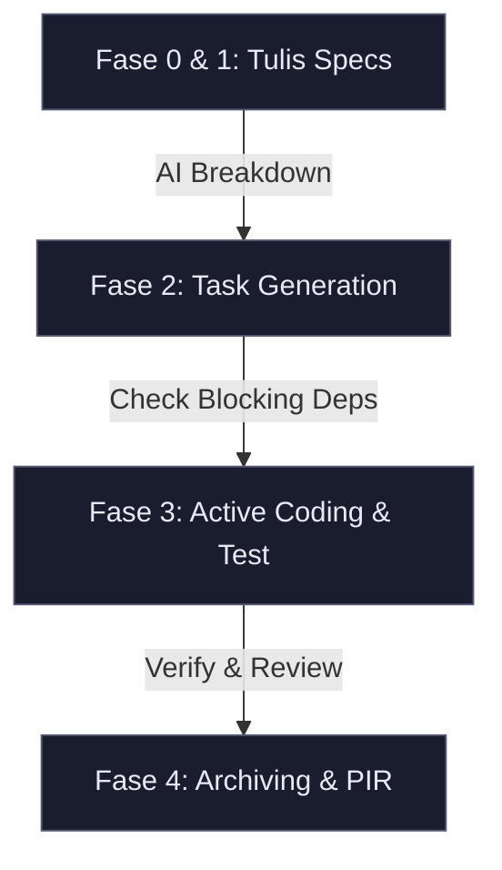

# 📖 Panduan Alur Kerja & Skenario Use Case DAC (Document-as-Code)

Dokumen ini menjelaskan bagaimana Anda (sebagai Developer/PM) berkolaborasi dengan AI Agent menggunakan kerangka kerja DAC untuk mengelola proyek software dengan efisien, terstruktur, dan hemat token API.

---

## 🏗️ Siklus Hidup Pengerjaan Fitur (The Core Loop)

Siklus hidup pengembangan fitur di DAC mengalir melalui **4 Fase Utama** dari ide hingga rilis produksi:



---

## ⚡ Skenario Kasus Nyata: Menambahkan Fitur "Kirim OTP via WhatsApp"

Mari kita ikuti bagaimana fitur ini dikerjakan langkah-demi-langkah menggunakan DAC.

### 🎬 Latar Belakang Proyek
Anda memiliki aplikasi e-commerce yang sudah berjalan. Saat register, user menerima OTP via email. Sekarang, Anda ingin menambahkan opsi pengiriman OTP via WhatsApp menggunakan API gateway pihak ketiga (misalnya Twilio/Woot).

---

### 📂 Langkah 1: Tulis Spesifikasi Fitur (Specs/)
*Dilakukan oleh: Manusia (bisa dibantu AI melalui wawancara)*

Anda tidak langsung meminta AI untuk menulis kode. Pertama, definisikan arsitekturnya di `/Specs` agar AI memahami batasan sistem dan tidak membuat asumsi salah.

Buat berkas [`Specs/S05-whatsapp-otp.md`](file:///home/dev-02/aris/dac/Specs/S05-whatsapp-otp.md):
```markdown
---
id: S05
title: Integrasi WhatsApp OTP untuk Register
status: DRAFT
type: FEATURE
created_at: 2026-07-06
author: Aris (Project Manager)
---

# 🔌 Integrasi WhatsApp OTP

## 🎯 Tujuan
Mengurangi biaya pengiriman OTP email dan meningkatkan conversion rate register dengan menyediakan opsi OTP WhatsApp.

## 🛠️ Desain Teknis
- **Third-party API**: Gateway API Woot (URL: `https://api.woot.com/v1/send`)
- **Tabel Database Baru**: Tidak ada. Gunakan tabel `user_otps` yang sudah ada (tambah kolom `phone_number` jika belum ada).
- **Helper Existing**: Gunakan helper HTTP client di `src/utils/http.ts` untuk memicu request.
- **Batasan (Constraints)**:
  - Kirim OTP WhatsApp hanya jika nomor telepon berawalan kode negara (misal +62).
  - Rate limit: Maksimal 3 kali request OTP per nomor dalam 10 menit.
```
Setelah itu, daftarkan file ini di [`Specs/_index.md`](file:///home/dev-02/aris/dac/Specs/_index.md).

---

### 📋 Langkah 2: Breakdown Menjadi Tugas Aktif (Tasks/)
*Dilakukan oleh: AI Agent*

Buka AI Agent Anda (Cursor, Claude Code, dll.) dan berikan instruksi:
> *"Berdasarkan spesifikasi di Specs/S05-whatsapp-otp.md, buat breakdown tugas pengerjaannya di Tasks."*

**Respon AI**:
AI akan membaca spesifikasi tersebut, melihat file index tugas di `/Tasks/_index.md` untuk mencari nomor urut task aktif berikutnya (misalnya `007` dan `008`), lalu melakukan hal berikut:

1. Membuat berkas [`Tasks/task-007.md`](file:///home/dev-02/aris/dac/Tasks/task-007.md):
   ```markdown
   ---
   id: 007
   title: Integrasi Helper WhatsApp API & Unit Test
   status: TODO
   urgency: HIGH
   category: Backend
   created_at: 2026-07-06
   blocked_by: []
   blocks: [008]
   source_spec: Specs/S05-whatsapp-otp.md
   ---
   
   ## 📝 Deskripsi Tugas
   Buat module helper WhatsApp di `src/helpers/whatsapp.ts` untuk memicu pengiriman OTP via Woot API.
   
   ## 🔍 Analisis Teknis
   - Gunakan `Axios` yang sudah terinstall di project.
   - Buat fungsi `sendWhatsAppOTP(phone: string, code: string): Promise<boolean>`.
   
   ## 🛠️ Sub-tasks Checklist
   - [ ] Buat file config key & URL Woot di `.env.example`
   - [ ] Implementasikan helper `src/helpers/whatsapp.ts`
   - [ ] Tulis 100% unit test coverage untuk helper dengan melakukan mocking API call
     *Verification:* Jalankan `npm run test src/helpers/whatsapp.test.ts`
   ```

2. Membuat berkas [`Tasks/task-008.md`](file:///home/dev-02/aris/dac/Tasks/task-008.md):
   ```markdown
   ---
   id: 008
   title: Update Flow Register API & Uji Integrasi
   status: TODO
   urgency: HIGH
   category: Backend
   created_at: 2026-07-06
   blocked_by: [007]
   blocks: []
   source_spec: Specs/S05-whatsapp-otp.md
   ---
   
   ## 📝 Deskripsi Tugas
   Modifikasi flow register controller di `src/controllers/auth.controller.ts` agar mendeteksi input nomor telepon dan mengirimkan OTP via WhatsApp selain dari Email.
   
   ## 🛠️ Sub-tasks Checklist
   - [ ] Update validasi input register di schema Joi/Zod
   - [ ] Integrasikan helper WhatsApp OTP ke auth service register flow
   - [ ] Jalankan API integration test register
     *Verification:* Lakukan request POST ke `/api/auth/register` menggunakan Postman/Curl
   ```

3. AI otomatis mendaftarkan kedua tugas baru ini ke tabel **Active Tasks** di [`Tasks/_index.md`](file:///home/dev-02/aris/dac/Tasks/_index.md).

---

### 💻 Langkah 3: Eksekusi & Pengodean
*Dilakukan oleh: AI Agent*

Anda ingin mulai mengerjakan task helper. Berikan perintah ke AI:
> *"Tolong kerjakan task-007."*

**Mengapa ini sangat efisien?**
AI **hanya** akan membaca `Tasks/task-007.md` dan file spesifikasi terkait. Ia tidak perlu memuat seluruh log percakapan lama atau file task lain. Ini menghemat memori token dan mencegah AI menjadi bingung.

1. AI akan menulis kode helper di `src/helpers/whatsapp.ts`.
2. AI menulis test case di `src/helpers/whatsapp.test.ts`.
3. AI mengeksekusi test case di terminal untuk verifikasi.
4. AI menandai checklist di file `task-007.md` sebagai selesai:
   ```markdown
   - [x] Implementasikan helper `src/helpers/whatsapp.ts`
   ```
5. AI mengubah status front matter di `task-007.md` menjadi `status: DONE`.
6. Anda (atau AI) memperbarui Tasks Index di `Tasks/_index.md` dengan menandai status `007` sebagai `DONE`.

---

### 🗄️ Langkah 4: Pembersihan & Arsip (Post-Mortem)
*Dilakukan oleh: AI / Manusia*

Setelah semua task dari fitur tersebut selesai (`task-007` dan `task-008` berstatus `DONE`):
1. Pindahkan berkas `task-007.md` dan `task-008.md` ke folder `/Tasks/Archive/`.
2. Di dalam file task yang diarsipkan, tambahkan bagian **Post-Mortem / PIR (Post-Implementation Review)** untuk pembelajaran di masa mendatang:
   ```markdown
   ## 📝 Post-Mortem
   - **Masalah:** API Woot sempat mengembalikan error 400 karena format nomor telepon tidak menyertakan tanda plus (+).
   - **Solusi:** Menambahkan helper sanitizer nomor telepon otomatis sebelum memicu request API.
   - **Commit ID:** `feat(auth): integrate whatsapp otp helper & tests (commit: a1b2c3d)`
   ```
3. Perbarui Tasks Index (`Tasks/_index.md`) untuk mencatat bahwa tugas tersebut telah diarsipkan secara permanen.

---

## 💡 Best Practices Menggunakan DAC

1. **Strict Context Isolation**: Biasakan untuk selalu menyuruh AI membaca index file terlebih dahulu sebelum mengerjakan tugas apa pun:
   > *"Baca Tasks/_index.md dulu, cari task yang berstatus TODO, lalu mulai kerjakan."*
2. **Jangan Biarkan File Task Terlalu Besar**: Jika sub-task pada file task Anda melebihi 10 item, pecahlah menjadi task baru dengan ID berikutnya.
3. **Automated Verification**: Setiap sub-task wajib memiliki instruksi *Verification* yang konkret (seperti perintah test atau curl) agar AI dapat menguji kodenya secara mandiri sebelum melapor kepada Anda.
4. **Gunakan Dashboard Visual**: Pantau status graph dependensi antar task secara berkala menggunakan perintah `./dac/dac.sh start` di browser untuk memastikan tidak ada deadlock dependensi.
