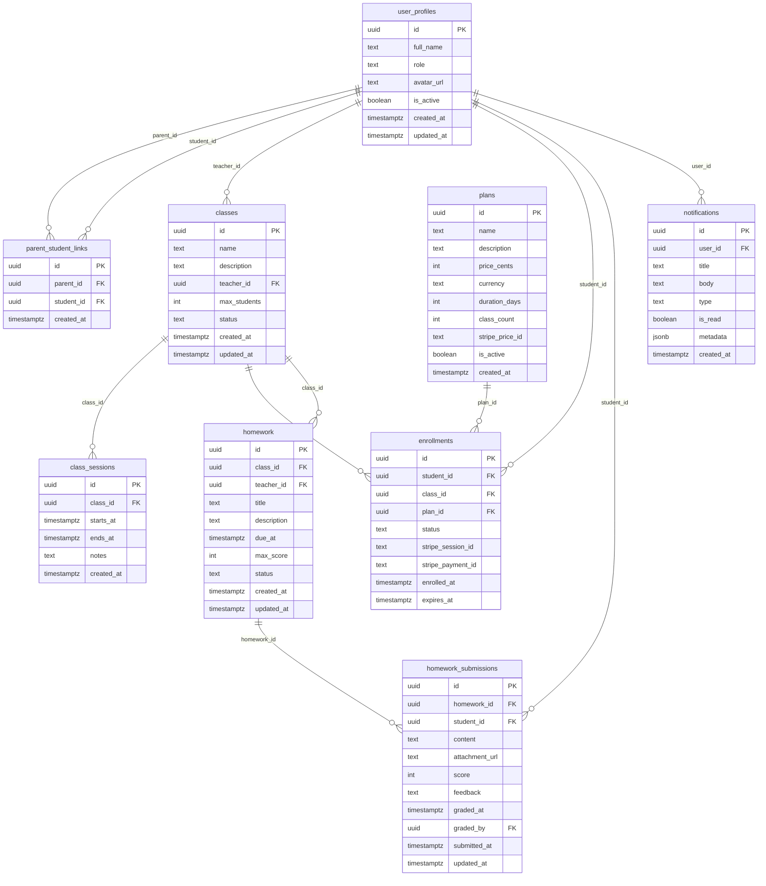

# Architecture — System Design Reference

> 📌 **Panduan AI**: File ini berisi keputusan desain teknis proyek (Fase 1).
> Baca file ini saat akan membuat task yang berhubungan dengan database, infrastruktur,
> atau saat butuh memahami hubungan antar komponen sistem sebelum menulis kode.

---

## 🏗️ Architecture Overview

```
Browser
  │
  ▼
Next.js 15 (App Router) — hosted on Vercel
  ├── /app/(auth)          → Login, Register, Invite flow
  ├── /app/(student)       → Protected: role=student
  ├── /app/(parent)        → Protected: role=parent
  ├── /app/(teacher)       → Protected: role=teacher
  ├── /app/(admin)         → Protected: role=admin
  ├── /app/(public)        → Landing page, pricing, enrollment
  └── /app/api/            → Route handlers (webhooks, server actions)
  │
  ▼
Supabase (Backend as a Service)
  ├── Auth                 → Session, JWT, invite tokens
  ├── Postgres + RLS       → Data utama dengan keamanan di level DB
  └── Storage              → File upload (homework attachments)
  │
  ▼
External Services
  ├── Stripe               → Payment processing (test mode)
  └── Resend               → Transactional email
```

## 🛠️ Tech Stack Decision

| Layer | Teknologi | Alasan Pemilihan |
|---|---|---|
| Framework | Next.js 15 (App Router) | Identik dengan Ottodot; SSR + API routes dalam 1 project |
| Language | TypeScript strict | Type safety, maintainability, sinyal production-grade |
| Styling | Tailwind CSS v4 | Utility-first, tidak ada config file, lebih modern |
| Components | Shadcn/ui | Accessible, production-grade, tidak reinvent the wheel |
| Database | Supabase Postgres | RLS native, auth terintegrasi, identik dengan Ottodot |
| Auth | Supabase Auth | Terintegrasi langsung dengan RLS — tidak bisa dipisah |
| Storage | Supabase Storage | File upload homework, dalam ekosistem yang sama |
| Payment | Stripe (test mode) | Standar industri, hosted checkout = PCI compliant otomatis |
| Email | Resend | Developer-friendly, generous free tier |
| Validation | Zod | Type-safe schema validation di server & client |
| Deploy | Vercel | Zero-config untuk Next.js, identik dengan Ottodot |

**Trade-offs yang disepakati:**
- Supabase Auth dipilih atas NextAuth → RLS terintegrasi langsung
- Supabase JS Client dipilih atas Prisma/Drizzle → menghindari bypass RLS
- Stripe Hosted Checkout dipilih atas Custom → PCI compliant, cepat implement
- Tidak ada backend terpisah (Express/Fastify) → Next.js Route Handlers cukup untuk scope ini

## 🗃️ Database Schema (ERD)



## 🔌 API Contract (Endpoints Utama)

### Auth
| Method | Endpoint | Role | Deskripsi |
|---|---|---|---|
| POST | `/api/auth/register` | Public | Register via invite token |
| POST | `/api/auth/logout` | Auth | Logout & clear session |

### Homework
| Method | Endpoint | Role | Deskripsi |
|---|---|---|---|
| GET | `/api/homework` | student, teacher | List homework |
| POST | `/api/homework` | teacher | Buat homework baru |
| GET | `/api/homework/[id]` | student, teacher, parent | Detail homework |
| PATCH | `/api/homework/[id]` | teacher | Update homework |
| GET | `/api/homework/[id]/submissions` | teacher | List semua submission |
| POST | `/api/homework/[id]/submissions` | student | Submit homework |
| PATCH | `/api/homework/[id]/submissions/[sid]` | teacher | Grade submission |

### Classes
| Method | Endpoint | Role | Deskripsi |
|---|---|---|---|
| GET | `/api/classes` | teacher, admin | List kelas |
| POST | `/api/classes` | teacher, admin | Buat kelas baru |
| GET | `/api/classes/[id]` | semua | Detail kelas |
| PATCH | `/api/classes/[id]` | teacher, admin | Update kelas |
| GET | `/api/classes/[id]/students` | teacher, admin | Roster student |

### Enrollment & Payment
| Method | Endpoint | Deskripsi |
|---|---|---|
| GET | `/api/plans` | List paket aktif |
| POST | `/api/checkout` | Buat Stripe Checkout session |
| POST | `/api/webhooks/stripe` | Handler Stripe webhook |

### Admin
| Method | Endpoint | Deskripsi |
|---|---|---|
| GET | `/api/admin/users` | List semua user |
| POST | `/api/admin/users` | Buat user + kirim invite |
| PATCH | `/api/admin/users/[id]` | Update role / status |
| POST | `/api/admin/parent-links` | Link parent ke student |
| GET | `/api/admin/reports/completion` | Laporan completion rate |

## 🔐 RLS Strategy

Semua tabel sensitif menggunakan Row Level Security. Prinsip utama:
- **Student**: hanya bisa akses data sendiri
- **Teacher**: bisa akses data student di kelasnya
- **Parent**: bisa akses data anak yang sudah di-link admin
- **Admin**: akses penuh ke semua data

Middleware Next.js (`src/middleware.ts`) menangani redirect berdasarkan role, tetapi **RLS adalah lapisan keamanan utama** — bukan middleware.

## ⚡ Potential Bottlenecks & Mitigations

- **Query N+1 pada parent dashboard**: Parent melihat data semua anaknya → gunakan join query + Supabase `select` dengan relasi, bukan multiple round trips
- **Webhook Stripe race condition**: Webhook bisa datang sebelum redirect selesai → idempotency check via `stripe_session_id` di tabel `enrollments`
- **RLS policy complexity**: Policy yang salah bisa expose atau block data → setiap policy wajib ditest dengan seed data multi-role sebelum deploy

---

*Terakhir diperbarui: 2026-09-20*
